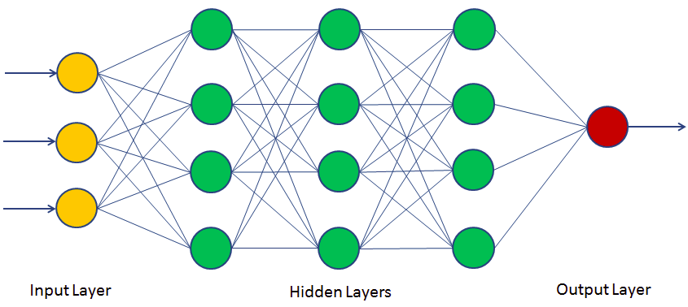

class: inverse, center, middle


```{r setup, include=FALSE}
options(htmltools.dir.version = FALSE)
library(tidyverse)

```

# RoboCup
<html><div style='float:left'></div><hr color='#EB811B' size=1px width=720px></html> 

???
The first thing that is important to understand is what RoboCup is.


---
# History and Goals
.pull-left[
* Started in 1997 with the goal of propelling AI and robotics research forward


* To achieve this, the goal to beat the 2050 world cup football champions with robots was set


* Modelled on similar successful endevours, such as IMB beating the chess world chmpion

* Since 1997 a competition has been held every year, with increasingly more powerful technology

]

.pull-right[

]


???
There was an unofficial test run in 1996

---
# Leagues

<!--  -->


* Robots

--

  * Humanoid

--

 * Standard Platform

--

	* Middle Size
	
--

	* Small Size

--
----
* Simulation

	* 2D

	* 3D
	


---
background-image: url("Presentation_Assets/Field map.png")
background-size: 85%
background-repeat: no-repeat

# Simulation League
<!--  -->

---
# Data

## HELIOS Player 3 Landmarks

----

```{r echo=FALSE, message=FALSE}
# Interactive data table showing one of the files
source(here::here("read-utils.R"))
read_landmarks("HELIOS", 3) %>% 
  select(1:6) %>% 
  filter(number_time != 0) %>% 
  head(10) %>% 
  knitr::kable("html") %>% 
  kableExtra::kable_styling("striped")

```

???
* for each player we have
			* One sheet showing landmarks angles and distances
			* One sheet showing other player angles and distances
		  * And one ground truth sheet for player positions
There is also one universal landmark coordinate sheet which is the same accross all games

---
class: inverse, center, middle
# The Problem
<html><div style='float:left'></div><hr color='#EB811B' size=1px width=720px></html> 

---
# Self Localisation
## Where are we?
<!-- <hr style="height:1px; visibility:hidden;" /> -->

.center[
  <video width="99%" style="margin-top: 5px;" autoplay>
    <source src="Presentation_Assets/RoboCup Demo.mp4" type="video/mp4">
  </video>
]


???
* Identifying where a player is on the field at any given time
* Based on landmarks


As you can see based on the data, a lot of information about the surroundings is given, but the exact location is not. 

In the same way that a real player needs to figure out where they are based on their surroundings, our agents have to as well

---
background-image: url("Presentation_Assets/Agent View.png")
background-size: 90%
background-repeat: never
# Self Localisation
## Where are we?
<!-- Image of players with angles drawn. -->


---
background-image: url("Presentation_Assets/Agent View Players.png")
background-size: 90%
background-repeat: never
# Position of Other Players
## Where is everyone else?
???
* Once we know where we are, where is everyone else?
* Using players as reference points instead of flags.

---
class: inverse, center, middle
# Mathematical Localisation
<html><div style='float:left'></div><hr color='#EB811B' size=1px width=720px></html> 

---
# Mathematical Localisation

## Trigonometry
If we have the distances between the player and the landmarks, along with the angles between the landmarks relative to the player, **Sine Rule** and **Cosine Rule** can be used to get all of the dimensions of triangle formed. 

----

## Vector algebra
Using the rotation matrix:

$$M = \begin{pmatrix}cos(\theta) & -sin(\theta)\\\ sin(\theta) & cos(\theta)\end{pmatrix}$$

The bearing of the player from a flag can be found.


---
# Mathematical Localisation


---
class: inverse, center, middle
# Neural Network Approaches
<html><div style='float:left'></div><hr color='#EB811B' size=1px width=720px></html> 

---
background-image: url("Presentation_Assets/Neural Network 3.png")
# Neural Networks
<!--  -->

???

Neural networks learn function mappings based on training data. 

They can pick up on patterns that aren't immediately obvious and take into account past values. 

---
# Neural Networks for Localisation
* Decrease error through taking into account error differences

* Taking into account previous values in order to predict the current value

.center[

]

---
# Neural Networks for Positioning

* Track player movement and learn programmed patterns

* Predict for un-observed players

.center[

]

---
class: inverse, center, middle
# Questions?
<html><div style='float:left'></div><hr color='#EB811B' size=1px width=720px></html> 
